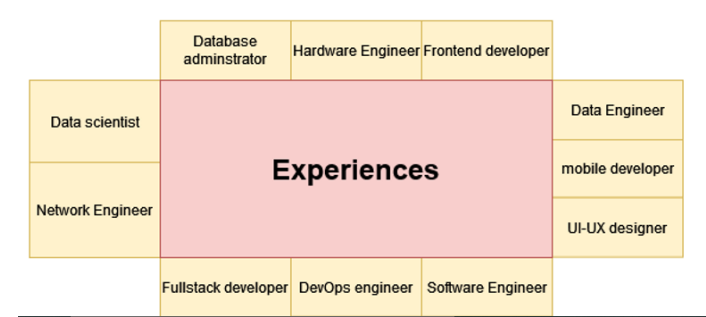

# vacuum-cleaner
This repository stores the codes for cleaning the data.

One of the challenges for data scientists is to transform the dirty data to clean data.
In order to build a machine learning model, we need to form our data to what we want.

## How is data preprocessing done in this prject?

we have three fields which are:
- Skills
- Educations
- Experiences

### Skills
For skills, data binning technique is used to categorize skills into categories below.

### Educations
For educations, we divide people into four categories. The categories are below.

### Experiences
For experiences which are also our output and input, we have categories below.

